# Terraform Magalu Cloud Container Registry Module

Módulo Terraform para criação e gerenciamento de Container Registries na Magalu Cloud com funcionalidades completas para DevOps e CI/CD.

## Sequence Diagram(s)

```mermaid
sequenceDiagram
    participant User
    participant Terraform
    participant MagaluCloud

    User->>Terraform: Fornece variáveis (API Key, region, nomes)
    Terraform->>MagaluCloud: Provisiona Container Registry
    Terraform->>MagaluCloud: (Opcional) Consulta registries, repositórios, imagens, credenciais
    MagaluCloud-->>Terraform: Retorna dados dos recursos
    Terraform-->>User: Exibe outputs (IDs, credenciais, análises, alertas)
```



## 🚀 Início Rápido

### Uso Básico
```hcl
module "container_registry" {
  source =  "https://github.com/terraform-mgc-modules/mgc-container-registry?ref=v1.0.0"
  
  container_registry_name = "meu-registry-app"
}

output "registry_id" {
  value = module.container_registry.container_registry_id
}
```

### Uso Avançado com Credenciais
```hcl
module "container_registry" {
  source = "https://github.com/terraform-mgc-modules/mgc-container-registry?ref=v1.0.0"
  
  container_registry_name     = "producao-apps"
  enable_credentials_output   = true
  enable_repositories_data   = true
}

output "registry_credentials" {
  value     = module.container_registry.container_credentials
  sensitive = true
}
```

## 📚 Exemplos Completos

Este módulo inclui exemplos práticos prontos para uso:

- **[Exemplo Simples](./examples/simple/)** - Registry básico para desenvolvimento.
- **[Exemplo Completo](./examples/complete/)** - Configuração avançada com 3 registries demonstrando todas as funcionalidades.

### Como usar os exemplos:
```bash
# Exemplo simples
cd examples/simple
terraform init
terraform plan
terraform apply

# Exemplo completo  
cd examples/complete
terraform init
terraform plan
terraform apply
```

---

## 📋 Referência Técnica

<details>
<summary><strong>📦 Requirements & Providers</strong></summary>

### Requirements

| Name                                                    | Version |
| ------------------------------------------------------- | ------- |
| <a name="requirement_mgc"></a> [mgc](#requirement\_mgc) | 0.33.0  |

### Providers

| Name                                              | Version |
| ------------------------------------------------- | ------- |
| <a name="provider_mgc"></a> [mgc](#provider\_mgc) | 0.33.0  |

### Resources

| Name                                                                                                                                               | Type        |
| -------------------------------------------------------------------------------------------------------------------------------------------------- | ----------- |
| [mgc_container_registries.registry](https://registry.terraform.io/providers/magalucloud/mgc/0.33.0/docs/resources/container_registries)            | resource    |
| [mgc_container_credentials.creds](https://registry.terraform.io/providers/magalucloud/mgc/0.33.0/docs/data-sources/container_credentials)          | data source |
| [mgc_container_images.images](https://registry.terraform.io/providers/magalucloud/mgc/0.33.0/docs/data-sources/container_images)                   | data source |
| [mgc_container_registries.all_registries](https://registry.terraform.io/providers/magalucloud/mgc/0.33.0/docs/data-sources/container_registries)   | data source |
| [mgc_container_repositories.repositories](https://registry.terraform.io/providers/magalucloud/mgc/0.33.0/docs/data-sources/container_repositories) | data source |

</details>

<details>
<summary><strong>🔧 Inputs</strong></summary>

| Name                                                                                                              | Description                                                                                      | Type     | Default                   | Required |
| ----------------------------------------------------------------------------------------------------------------- | ------------------------------------------------------------------------------------------------ | -------- | ------------------------- | :------: |
| <a name="input_container_registry_name"></a> [container\_registry\_name](#input\_container\_registry\_name)       | The name of the container registry to create.                                                    | `string` | `"my-container-registry"` |    no    |
| <a name="input_enable_credentials_output"></a> [enable\_credentials\_output](#input\_enable\_credentials\_output) | Whether to output container registry credentials. Set to true if you need access credentials.    | `bool`   | `false`                   |    no    |
| <a name="input_enable_images_data"></a> [enable\_images\_data](#input\_enable\_images\_data)                      | Whether to fetch images data from the specified repository. Requires repository\_name to be set. | `bool`   | `false`                   |    no    |
| <a name="input_enable_registries_list"></a> [enable\_registries\_list](#input\_enable\_registries\_list)          | Whether to fetch a list of all container registries. Useful for reference or comparison.         | `bool`   | `false`                   |    no    |
| <a name="input_enable_repositories_data"></a> [enable\_repositories\_data](#input\_enable\_repositories\_data)    | Whether to fetch repositories data from the created registry.                                    | `bool`   | `false`                   |    no    |
| <a name="input_mgc_api_key"></a> [mgc\_api\_key](#input\_mgc\_api\_key)                                           | API Key da Magalu Cloud para testes                                                              | `string` | n/a                       |   yes    |
| <a name="input_mgc_region"></a> [mgc\_region](#input\_mgc\_region)                                                | Região da Magalu Cloud (ex: br-se1)                                                              | `string` | `"br-se1"`                |    no    |
| <a name="input_repository_name"></a> [repository\_name](#input\_repository\_name)                                 | Name of a specific repository to fetch images data from. Leave null if not needed.               | `string` | `null`                    |    no    |

</details>

<details>
<summary><strong>📤 Outputs</strong></summary>

| Name                                                                                                                                                           | Description                                             | Availability                                               |
| -------------------------------------------------------------------------------------------------------------------------------------------------------------- | ------------------------------------------------------- | ---------------------------------------------------------- |
| <a name="output_all_registries"></a> [all\_registries](#output\_all\_registries)                                                                               | List of all container registries in the account         | When `enable_registries_list = true`                       |
| <a name="output_container_credentials"></a> [container\_credentials](#output\_container\_credentials)                                                          | Container registry authentication credentials           | When `enable_credentials_output = true`                    |
| <a name="output_container_registry_created_at"></a> [container\_registry\_created\_at](#output\_container\_registry\_created\_at)                              | The timestamp when the registry was created             | When `enable_registries_list = true`                       |
| <a name="output_container_registry_id"></a> [container\_registry\_id](#output\_container\_registry\_id)                                                        | The unique identifier of the created container registry | Always                                                     |
| <a name="output_container_registry_name"></a> [container\_registry\_name](#output\_container\_registry\_name)                                                  | The name of the created container registry              | Always                                                     |
| <a name="output_container_registry_storage_usage_bytes"></a> [container\_registry\_storage\_usage\_bytes](#output\_container\_registry\_storage\_usage\_bytes) | The storage usage in bytes of the registry              | When `enable_registries_list = true`                       |
| <a name="output_container_registry_updated_at"></a> [container\_registry\_updated\_at](#output\_container\_registry\_updated\_at)                              | The timestamp when the registry was last updated        | When `enable_registries_list = true`                       |
| <a name="output_images"></a> [images](#output\_images)                                                                                                         | List of images in the specified repository              | When `enable_images_data = true` and `repository_name` set |
| <a name="output_repositories"></a> [repositories](#output\_repositories)                                                                                       | List of repositories in the created registry            | When `enable_repositories_data = true`                     |

</details>


## 📖 Documentação

### 🔧 Configuração
- **[Requisitos](#requisitos)** - Requirements e providers
- **[Variáveis](#inputs)** - Inputs disponíveis  
- **[Outputs](#outputs)** - Outputs do módulo

### 📚 Guias
- **[API Keys](./docs/api_keys.md)** - Como configurar autenticação
- **[Comandos CLI](./docs/commands.md)** - Comandos MGC CLI para Container Registry


### 📦 Estruturas de Dados

#### Credenciais (`container_credentials`)
```hcl
{
  username = "string"
  email    = "string" 
  password = "string" # sensível
}
```

#### Registry (`all_registries`) 
```hcl
[
  {
    id                   = "string"
    name                = "string"
    created_at          = "string"
    updated_at          = "string"
    storage_usage_bytes = number
  }
]
```

## 💡 Casos de Uso Comuns

### 1. CI/CD Integration
```hcl
module "ci_registry" {
  source = "github.com/nataliagranato/mgc-container-registry"
  
  container_registry_name   = "ci-cd-apps"
  enable_credentials_output = true
}

# Configure GitHub Actions
resource "github_actions_secret" "registry_username" {
  repository      = "meu-repo"
  secret_name     = "REGISTRY_USERNAME"
  plaintext_value = module.ci_registry.container_credentials.username
}
```

### 2. Multi-Environment Setup
```hcl
module "dev_registry" {
  source = "github.com/nataliagranato/mgc-container-registry"
  container_registry_name = "dev-apps"
}

module "prod_registry" {
  source = "github.com/nataliagranato/mgc-container-registry"
  container_registry_name = "prod-apps"
  enable_credentials_output = true
}
```

## 🛠️ Requisitos

- **Terraform** >= 0.14
- **Provider MGC** >= 0.33.0  
- **API Key** da Magalu Cloud com permissões Container Registry

```hcl
terraform {
  required_providers {
    mgc = {
      source  = "magalucloud/mgc"
      version = "~> 0.33.0"
    }
  }
}

provider "mgc" {
  api_key = var.mgc_api_key
  region  = "br-se1"
}
```

## 🤝 Contribuição

Consulte [CONTRIBUTING.md](CONTRIBUTING.md) para diretrizes de contribuição.

## 🔒 Segurança

Para reportar vulnerabilidades, veja [SECURITY.md](SECURITY.md).

## 📄 Licença

Este projeto está sob a licença especificada no arquivo [LICENSE](LICENSE).

---

**Feito com ❤️ por [Natália Granato](https://github.com/nataliagranato)**
